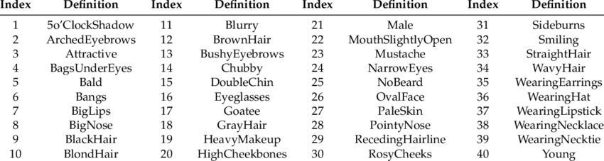
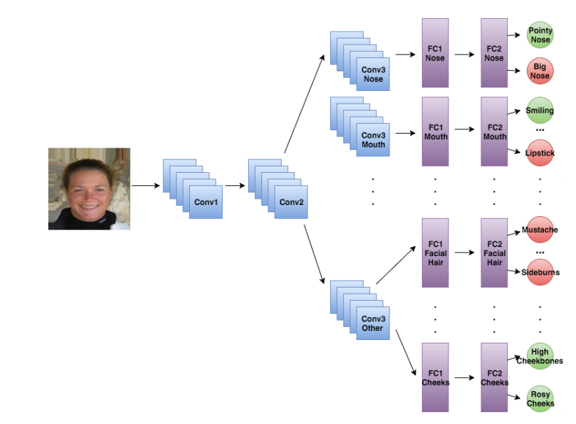
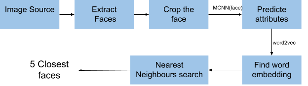

# Face Search
This is like a recommendation system for faces and uses the CelebA dataset

There are two parts to this solution

1. Face Attributes: Design a DNN that gives the facial attributes, given a face image
2. Face Similarity: Represent the face attributes in a vector space and use this to find similar faces

## Dataset Used

CelebA: https://mmlab.ie.cuhk.edu.hk/projects/CelebA.html

This dataset has more than 200K images, each annotated with 40 attributes. Here is the table of these attributes.

1. ## Face Attributes:

   The dataset has 40 attributes annotated for each face. It is clear from this list of attributes that they can be easily groups based on the segment of the face which needs to be looked in order to observe the particular attribute. Some of these groups are:  nose, eyes, hair etc. My model has these various parts to it:

   - Shared lower layers for all groups
   - The higher layers are shared for different attributes belonging to the same group

   reference paper: "Attributes for Improved Attributes: A Multi-Task Network for Attribute Classification" - Emily M. Hand and Rama Chellappa [pdf](https://github.com/MittalNeha/similar_faces/blob/main/1604.07360.pdf)

2. ## Face Similarity: 

   My idea for looking for similar faces is to use the attributes of each face to get a vector representation for it. For this I have trained a word2vec using training set. Given the vector space for each face, its easy to find nearby faces in the vector space.
   
   
   
   
   
   
